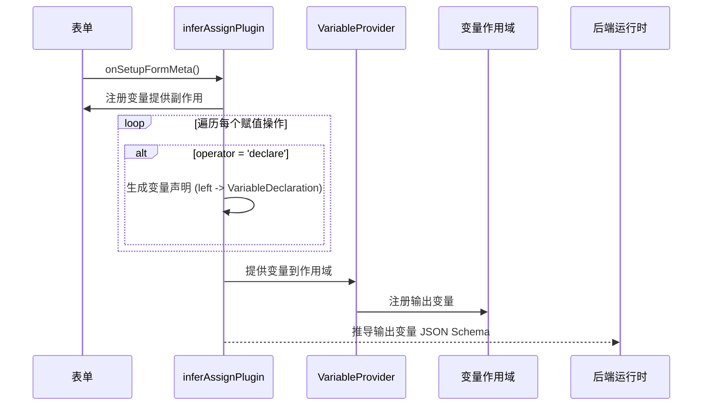

import { SourceCode } from '@theme';
import { BasicStory } from 'components/form-materials/form-plugins/infer-assign-plugin';

# inferAssignPlugin

`inferAssignPlugin` 是用于变量赋值节点，进行输出变量自动推导的表单插件，通常和 [`AssignRows`](../components/assign-rows) 物料配合使用。

插件针对 `AssignRows` 的 `declare` (声明新变量) 实现了以下能力：
- 自动生成节点输出变量，变量名即 `declare` 操作符中的左值，变量类型会自动根据 `right` 进行联动推导。
- 当提交数据到后端时，自动根据输出变量的变量类型，联动生成对应的 JSON Schema。

## 案例演示

### 基本使用

:::tip

点开 demo 右上角的 Debug 面板，查看传到后端的 JSON 数据

:::

<BasicStory />

```tsx pure title="form-meta.tsx"
import { createInferAssignPlugin, AssignRows, DisplayOutputs } from '@flowgram.ai/form-materials';

export const VariableFormRender = ({ form }) => {
  return (
    <>
      <FormHeader />
      <AssignRows
        name="assign"
        defaultValue={[
          // 从常量声明变量
          {
            operator: 'declare',
            left: 'userName',
            right: {
              type: 'constant',
              content: 'John Doe',
              schema: { type: 'string' },
            },
          },
          // 从变量声明变量
          {
            operator: 'declare',
            left: 'userInfo',
            right: {
              type: 'ref',
              content: ['start_0', 'obj'],
            },
          },
          // 赋值现有变量
          {
            operator: 'assign',
            left: {
              type: 'ref',
              content: ['start_0', 'str'],
            },
            right: {
              type: 'constant',
              content: 'Hello Flowgram',
              schema: { type: 'string' },
            },
          },
        ]}
      />
      <DisplayOutputs displayFromScope />
    </>
  );
};

export const formMeta: FormMeta = {
  render: VariableFormRender,
  plugins: [
    createInferAssignPlugin({
      assignKey: 'assign',
      outputKey: 'outputs'
    })
  ],
};
```

## API 参考

```typescript
function createInferAssignPlugin(options: {
  assignKey: string;
  outputKey: string;
}): FormPlugin;
```

| 属性名 | 类型 | 默认值 | 说明 |
| :--- | :--- | :--- | :--- |
| assignKey | `string` | - | 表单中存储赋值操作数组的字段路径，值类型为 `AssignValueType[]` |
| outputKey | `string` | - | 输出 JSON Schema 的存储位置字段路径 |


## 源码导读

<SourceCode
  href="https://github.com/bytedance/flowgram.ai/tree/main/packages/materials/form-materials/src/form-plugins/infer-assign-plugin"
/>

使用 CLI 命令可以复制源代码到本地:

```bash
npx @flowgram.ai/cli@latest materials form-plugins/infer-assign-plugin
```

### 目录结构讲解

```plaintext
infer-assign-plugin/
└── index.ts                  # 插件主入口，创建插件并导出
```

### 核心实现说明




### 依赖梳理

#### flowgram API

[**@flowgram.ai/editor**](https://github.com/bytedance/flowgram.ai/tree/main/packages/client/editor)
- `defineFormPluginCreator`: 定义表单插件的工厂函数
- `FormPlugin`: 表单插件类型定义
- `FormPluginSetupMetaCtx`: 插件设置上下文，提供 `mergeEffect`、`addFormatOnSubmit` 方法

[**@flowgram.ai/variable-core**](https://github.com/bytedance/flowgram.ai/tree/main/packages/variable-engine/variable-core)

[**@flowgram.ai/json-schema**](https://github.com/bytedance/flowgram.ai/tree/main/packages/variable-engine/json-schema)
- `IJsonSchema`: JSON Schema 类型定义

#### 依赖的其他物料

[**FlowValue**](../common/flow-value)
- `FlowValueUtils.inferJsonSchema()`: 推断 IFlowValue 的 JSON Schema
- `FlowValueUtils.isConstant()`, `FlowValueUtils.isRef()`: 类型判断工具
- `IFlowValue`: Flow 值的联合类型
- `IFlowRefValue`: 变量引用类型
- `IFlowConstantValue`: 常量类型
