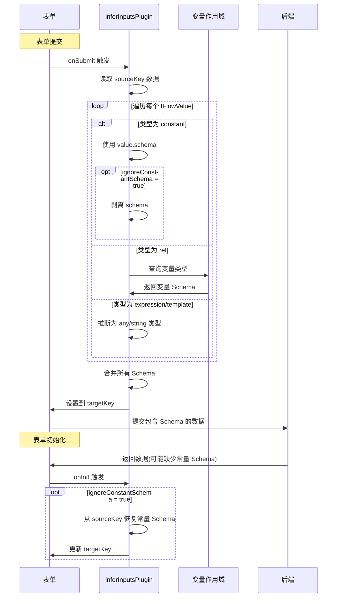

import { SourceCode } from '@theme';
import { BasicStory } from 'components/form-materials/form-plugins/infer-inputs-plugin';

# inferInputsPlugin

`inferInputsPlugin`是一个用于**自动推断输入参数 JSON Schema 的表单插件**，它能**在数据传送到后端运行时前**，根据 IFlowValue 类型 (常量或变量引用) 自动生成对应的 JSON Schema 结构，为后端的运行时类型验证和后端接口提供类型信息。

<br />
<div>
  
  *传到后端运行时时，inputs 字段的 JSON Schema 根据 inputsValues 中的值定义推导*
</div>

:::tip{title="适用场景"}

- **HTTP 节点**：推断请求头 (headers)、查询参数 (params) 的 Schema
- **代码节点**：推断代码输入参数的类型结构
- **函数调用节点**：推断函数参数的 Schema
- **任何接受动态输入的节点**：需要为后端提供输入类型信息

:::

## 案例演示

### 基本使用


### 基本使用

:::tip

点开 demo 右上角的 Debug 面板，查看传到后端的 JSON 数据

:::

<BasicStory />

推断 HTTP 请求的 headers 和 body 的 Schema:

```tsx pure title="form-meta.tsx"
import { createInferInputsPlugin, InputsValue, InputsValuesTree } from '@flowgram.ai/form-materials';
import { Field } from '@flowgram.ai/editor';

export const HttpFormRender = ({ form }) => {
  return (
    <>
      <FormHeader />
      <FormContent>
        <Field<Record<string, IFlowValue>> name="headersValues">
          {({ field }) => (
            <InputsValues
              value={field.value}
              onChange={(val) => field.onChange(val)}
            />
          )}
        </Field>
        <Field<Record<string, IFlowValue>> name="bodyValues">
          {({ field }) => (
            <InputsValuesTree
              value={field.value}
              onChange={(val) => field.onChange(val)}
            />
          )}
        </Field>
      </FormContent>
    </>
  );
};

export const formMeta: FormMeta = {
  render: HttpFormRender,
  plugins: [
    // 推断 headers 的 Schema
    createInferInputsPlugin({
      sourceKey: 'headersValues',
      targetKey: 'headersSchema'
    }),
    // 推断 body 的 Schema
    createInferInputsPlugin({
      sourceKey: 'bodyValues',
      targetKey: 'bodySchema'
    })
  ],
};
```

## API 参考

```typescript
function createInferInputsPlugin(options: {
  sourceKey: string;
  targetKey: string;
  scope?: 'private' | 'public';
  ignoreConstantSchema?: boolean;
}): FormPlugin;
```

| 属性名 | 类型 | 默认值 | 说明 |
| :--- | :--- | :--- | :--- |
| sourceKey | `string` | - | 表单中存储输入值的字段路径，值类型为包含 IFlowValue 的对象或数组 |
| targetKey | `string` | - | 推断的 JSON Schema 存储位置的字段路径 |
| scope | `'private' \| 'public'` | `public` | 指定用于变量解析的作用域类型 |
| ignoreConstantSchema | `boolean` | `false` | 是否在提交时剥离常量值的 Schema(仅保留变量引用的 Schema) |

## 源码导读

<SourceCode
  href="https://github.com/bytedance/flowgram.ai/tree/main/packages/materials/form-materials/src/form-plugins/infer-inputs-plugin/index.ts"
/>

使用 CLI 命令可以复制源代码到本地：

```bash
npx @flowgram.ai/cli@latest materials form-plugins/infer-inputs-plugin
```

### 目录结构讲解

```plaintext
infer-inputs-plugin/
└── index.tsx  # 插件完整实现，包含 Schema 推断和双向转换逻辑
```

### 核心实现说明

`inferInputsPlugin` 的核心功能是从 IFlowValue 对象推断 JSON Schema。对于常量值，直接使用其 `schema` 字段；对于变量引用，从作用域中查询变量类型；对于表达式和模板，推断为相应的基础类型。插件还支持 `ignoreConstantSchema` 优化，在提交时剥离常量 Schema，在初始化时自动恢复。

#### 工作流程时序图



核心功能特点：

1. **自动 Schema 推断**：扫描表单数据中的 IFlowValue 对象，自动推断其 JSON Schema
2. **变量类型解析**：对于变量引用，从作用域中解析变量的实际类型
3. **常量 Schema 优化**：可选地在提交时剥离常量的 Schema，减少后端数据负载
4. **双向转换**：在表单初始化时恢复 Schema，在表单提交时生成 Schema

### 依赖梳理

#### flowgram API

[**@flowgram.ai/editor**](https://github.com/bytedance/flowgram.ai/tree/main/packages/client/editor)
- `defineFormPluginCreator`: 定义表单插件的工厂函数
- `FormPlugin`: 表单插件类型定义
- `FormPluginSetupMetaCtx`: 插件设置上下文，提供 `addFormatOnInit`、`addFormatOnSubmit` 方法

[**@flowgram.ai/variable-core**](https://github.com/bytedance/flowgram.ai/tree/main/packages/variable-engine/variable-core)

[**@flowgram.ai/json-schema**](https://github.com/bytedance/flowgram.ai/tree/main/packages/variable-engine/json-schema)
- `IJsonSchema`: JSON Schema 类型定义

#### 依赖的其他物料

[**FlowValue**](../common/flow-value)
- `FlowValueUtils.inferJsonSchema()`: 推断 IFlowValue 的 JSON Schema
- `FlowValueUtils.traverse()`: 遍历嵌套的 FlowValue 结构
- `FlowValueUtils.isConstant()`, `FlowValueUtils.isRef()`: 类型判断工具
- `IFlowValue`: Flow 值的联合类型
- `IFlowConstantValue`: 常量类型，包含 `schema` 字段
- `IFlowRefValue`: 变量引用类型，包含变量路径
